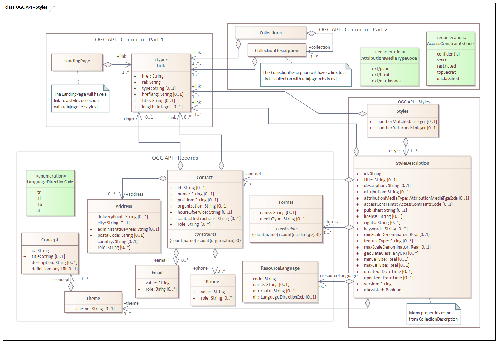

== Introduction

[[Overview]]
=== Overview

This document specifies API building blocks for Web APIs to manage and fetch styles supporting multiple style encodings and metadata to describe and discover styles.

The Styles API supports several types of consumers, mainly:

* Visual style editors that create, update and delete styles for datasets that are shared by other Web APIs implementing the OGC API - Features - Part 1: Core standard or the draft OGC API - Coverages or draft OGC API - Tiles specifications;
* Web APIs implementing the OGC API - Maps Standard fetch styles and render spatial data (features or coverages) on the server;
* Map clients that fetch styles and render spatial data (features or coverages) on the client.

Feature data is either accessed directly or organized into spatial partitions such as a tiled data store (aka "vector tiles").

The remainder of this Clause illustrates use cases and workflows that a Styles API could support.

Clause 7 specifies the API building blocks.

[[use-cases]]
=== Use cases

This section describes expectations of how clients will interact with a Styles API.

The following use cases assume that:

* Some feature dataset that is structured according to a data specification, such as the NGA Topographic Data Store 6.1 (TDS), is available via an API that implements the OGC API - Features - Part 1: Core and draft OGC API - Tiles specifications;
* Roads are included in the data in a collection `TransportationGroundCrv` as features with a property f_code with a value of AP030;
* The URI of the landing page is `http://example.org/data-api`;
* A style repository is available via an API that implements the Styles API specification;
* The URI of the landing page of the Styles API is `http://example.org/styles-api`.

NOTE: The URIs in the use case descriptions are examples and use the domain `example.org`, a link:https://www.iana.org/domains/reserved[reserved domain maintained by IANA] for illustrative examples in documents without prior coordination with IANA.

==== A map client

A map client that wants to visualize data for features or tiled feature data for the collection `http://example.org/data-api/collections/TransportationGroundCrv` will look for a `styles` member in the response. The client will probably select one of the styles from the list taking the media types of the supported stylesheets into account and provide a capability so that users can change the style. The stylesheet returned based on the `href` member of the link will be used to render the data.

In addition to feature data, the map client might also fetch a hillshade style to apply to an elevation coverage accessed from a Web API supporting OGC API Coverages.

==== A visual style editor creating a new style

A user wants to create a new style for TDS roads using a visual style editor. The user knows the dataset and the data access API.

A user creates the style in the visual style editor, selects the native stylesheet language for the style and identifies the `TransportationGroundCrv` collection in the dataset as a sample data source. The visual style editor executes a request to the landing page (`http://example.org/data-api`) and the conformance declaration (`http://example.org/data-api/conformance`) of the data access API to determine the API capabilities. Note that alternatively the OpenAPI definition may be inspected, but for a client that supports the OGC API standards in general, using the API resources directly is often simpler and, therefore, used in this example.

If the visual style editor supports, for example, both the styling of GeoJSON features or Mapbox Vector Tile data, the editor would require support for at least one of the two following sets of conformance classes:

* `http://www.opengis.net/spec/ogcapi-features-1/1.0/conf/core` and `http://www.opengis.net/spec/ogcapi-features-1/1.0/conf/geojson`
or
* `http://www.opengis.net/spec/ogcapi-tiles-1/1.0/conf/core` (with URI templates referencing tiles of media type `application/vnd.mapbox-vector-tile`).

The first option provides access to GeoJSON features via `http://example.org/data-api/collections/TransportationGroundCrv/items`, the second one provides access to Mapbox Vector Tiles (MVT) encoded data via `http://example.org/data-api/collections/TransportationGroundCrv/tiles`.

In addition, for feature data the visual style editor will look for the conformance class `http://www.opengis.net/spec/ogcapi-common-3/1.0/conf/schemas`
to determine the properties of the features and their schema from `http://example.org/data-api/collections/TransportationGroundCrv/schema` in order to use
feature attributes in styling rules.

The editor will typically also request information about the features in the collection via a request to `http://example.org/data-api/collections/TransportationGroundCrv`.

Based on this information, the visual style editor is able to configure its user interface and guide the user through the creation of the style for road features and visualize the draft style using the sample data. Once the user has finished the style, the style is published on a Style repository that supports the Styles API.

If the user requests the use of a Style repository that the editor interacts with for the first time, the editor will again inspect the capabilities of the repository by fetching the conformance declaration at `http://example.org/styles-api/conformance`.

At least the following conformance classes must be supported in order for sharing the new style via the repository.

* `http://www.opengis.net/spec/ogcapi-styles-1/1.0/conf/core`
* `http://www.opengis.net/spec/ogcapi-styles-1/1.0/conf/manage-styles`

Finally, the repository has to support the native stylesheet language that the user has selected for the style definition, i.e. one of:

* `http://www.opengis.net/spec/ogcapi-styles-1/1.0/conf/mapbox-styles`
* `http://www.opengis.net/spec/ogcapi-styles-1/1.0/conf/sld-10`
* `http://www.opengis.net/spec/ogcapi-styles-1/1.0/conf/sld-11`

The visual style editor will ask the user for her credentials in the style repository and use the credentials in any of the following POST/PUT/PATCH/DELETE requests.

If `http://www.opengis.net/spec/ogcapi-styles-1/1.0/conf/style-validation` is supported, the visual style editor can also offer validation of the draft style any time during the drafting process using POST requests with the draft stylesheet to `http://example.org/styles-api/styles?dry-run=true` and a header `Prefer: handling=strict`.

To create the new style the user sends a POST request with the stylesheet to `http://example.org/styles-api/styles`. `Prefer: handling=strict` may also be added to the request URI to trigger strict validation in this step, if the style validation conformance class is supported.

After a successful creation of the style (in case of a POST request, the URI of the new style `http://example.org/styles-api/styles/{styleId}` is returned in an HTTP header `Location`).

==== A visual style editor updating an existing style

The process is quite similar to the previous example with the following changes:

* The user will start from an existing style, not with a new style. In other words, the user will open/load the style from the style repository and the editor will fetch a stylesheet of the style from `http://example.org/styles-api/styles/{styleId}` (in the style encoding of choice)`.
* If the style metadata within the style sheet itself, or included in the entry for the style at `/styles`,  includes links to sample data (e.g., `http://example.org/data-api/collections/TransportationGroundCrv`), the editor may use that data for sample visualizations and perhaps to determine changes to queryables. The user may also select other data sources for these purposes.
* Since an existing style is replaced, the style definition will always be updated with a PUT request to `http://example.org/styles-api/styles/{styleId}` (no POST request to `http://example.org/styles-api/styles`, which would create a new style).

==== A Web API implementing OGC API - Maps and OGC API - Tiles

A Web API that implements the conformance class "Map tilesets" of the OGC API - Maps specification returns geo-referenced bitmap images showing maps.
The URI template for the map tiles is `/collections/{collectionId}/styles/{styleId}/map/tiles/{tileMatrixSetId}/{tileMatrix}/{tileRow}/{tileCol}`.
If a client requests a map tile for the collection `TransportationGroundCrv` the API will use the style `{styleId}` to render the map.

[[styles-api]]
==== API building blocks for styles

===== Base resources

Styles can be associated with a variety of resources in an API, for example, a feature dataset, a feature collection, or a coverage. This standard does not restrict the
resource types with which styles may be associated.

This standard uses the term "base resource" for such resources. In the API, styles are sub-resources of a base resource.

Typical base resources are:

* The API landing page at path `/`.
** If the API provides distributions of a dataset, then the styles will be associated with the dataset.
** If the API does not provide access to data, it is a general purpose Styles API and the styles will typically be applicable to a range of data resources available elsewhere.
* A data collection at path `/collections/{collectionId}`.

===== Resources referenced from styles

Stylesheets often reference external resources, especially symbols and fonts to be used in the rendering process. Symbols are either managed as a single file for each symbol
or they are organized in a sprite. In a sprite, all symbols are combined into a single bitmap image to reduce memory and the number of http requests.

Since these resources are referenced from stylesheets using a URI of the resource, the details where and how the resources are hosted are not important and this specification
does not specify API building blocks for publishing such resources.

===== Overview

The API building blocks support the resources and operations listed in the table below with the associated conformance class and the link to the document section that
specifies the requirements.

The `{baseResource}` is a path template for any API resource with which styles can be associated.

[#tldr2,reftext='{table-caption} {counter:table-num}']
.Overview of resources and applicable HTTP methods
[cols="15,24,8,18,25",options="header"]
!===
|Resource |Path |HTTP method |Conformance class|Document reference
|Base resource |`{baseResource}` |GET |core |<<base-resource>>
|Conformance declaration |`/conformance` |GET |core |<<conformance_declaration>>
.3+|Styles .3+|`{baseResource}/styles` |GET |core |<<get_styles>>
.2+|POST |manage-styles |<<create_style>>
|style-validation |<<style_validate>>
.4+|Style .4+|`{baseResource}/styles/{styleId}` |GET |core |<<get_style>>
.2+|PUT |manage-styles |<<replace_style>>
|style-validation |<<style_validate>>
|DELETE |manage-styles |<<delete_style>>
!===

This standard supports multiple style encodings (stylesheets) per style.
For example, an API may publish a "night" style in the style encodings OGC SLD 1.0, OGC SLD 1.1 and Mapbox Style.
The client will select the stylesheet that fits best based on its capabilities and preferences.

This standard does not specify any sub-resource of a Style resource.
APIs and other specification may specify sub-resources of a Style resource.
For example, a Map sub-resource could be provided that returns map representations of the base resource rendered using the style.

[[uml-model]]
=== UML Class Diagram

The following UML class diagram describes the data model for the list of styles that can be retrieved from `/styles` and/or `/collections/{collectionId}/styles`.

[[metadata-model]]
[#img_uml_model='{figure-caption} {counter:figure-num}']
.UML class diagram describing the list of styles and style metadata

